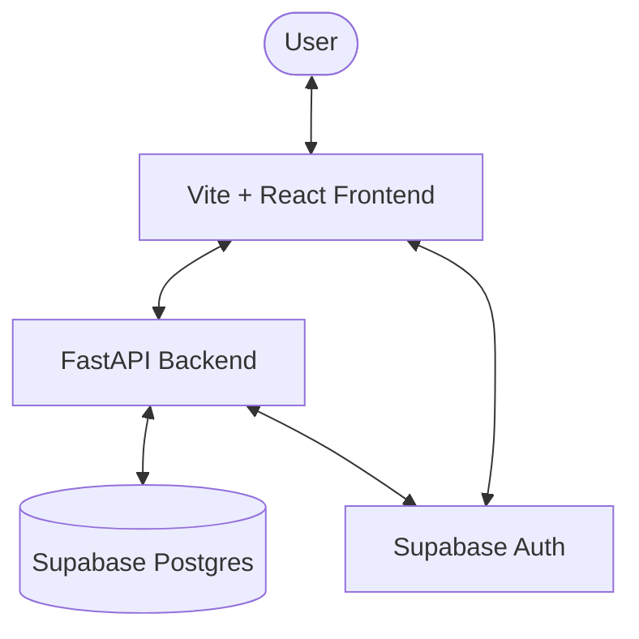

# Architecture

> Auto-generated by /map on 2026-03-13

## Overview

FlowAI is an AI-powered workflow automation platform that translates natural language descriptions into interactive, visual node graphs. It uses a decoupled architecture with a Python FastAPI backend and a React/TypeScript frontend.

## Components

### Backend (FastAPI)
- **Purpose:** Core business logic, NLP parsing, and database orchestration.
- **Location:** `backend/app/`
- **Key Modules:**
    - `api/routes/`: Endpoint definitions for Auth, Workflows, Integrations, and Profiles.
    - `services/`: Encapsulated logic for database operations and integration execution.
    - `nlp/parser.py`: Logic for converting text descriptions into structured JSON for React Flow.
    - `core/`: Global configuration and Supabase initialization.

### Frontend (React/TypeScript)
- **Purpose:** Visual workflow building, execution monitoring, and user management.
- **Location:** `frontend/src/`
- **Key Areas:**
    - `pages/`: Route-level components for Dashboard, Builder, Logs, and Settings.
    - `components/`: Reusable UI elements (Buttons, Cards, Modals).
    - `context/AuthContext.tsx`: Manages user session state and authentication flows.
    - `lib/`: Shared utilities and Supabase client configuration.

## Data Flow

1. **Workflow Creation:** User enters text → Frontend calls `/api/nlp/parse` → Backend returns node/edge JSON → Frontend renders via React Flow.
2. **Authentication:** Frontend uses Supabase-js for sessions → Backend verifies JWTs from Auth headers.
3. **Execution:** User triggers run → Backend updates `execution_logs` → Frontend polls or live-updates logs view.

## Integration Points

| Service | Type | Purpose |
|---------|------|---------|
| Supabase | Platform | Database (Postgres), Authentication, and File Storage. |
| Google OAuth | OAuth | Third-party user authentication. |
| NLP Model | Internal/AI | Text-to-Graph translation engine. |

## Technical Debt

- [ ] Secret Management: Integration secrets are not yet encrypted at rest (Phase 3 Plan).
- [ ] Session Hydration: Intermittent issues with session persistence across tabs (Phase 3 Plan).
- [ ] Performance: React Flow re-renders need optimization for large graphs (>20 nodes).

## Conventions

**Naming:** PascalCase for React components, snake_case for Python logic.
**Structure:** Feature-based routing in frontend, Service-Repository pattern in backend.
**Testing:** Basic verification scripts in `scripts/`, browser-based UAT for UI changes.
